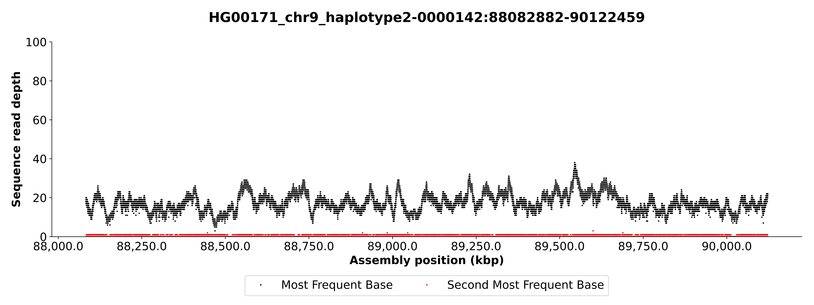
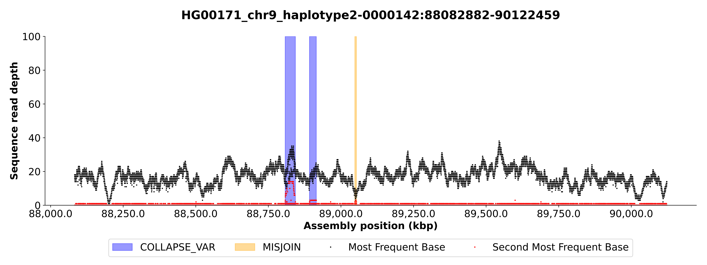

# `misasim`
Simulate a misassembly for a given fasta.

<table>
  <tr>
    <td>
      <figure float="left">
        
        <figcaption>Original</figcaption>
      </figure>
      <figure float="left">
        
        <figcaption>After misjoin of 5000 bp</figcaption>
      </figure>
    </td>
  </tr>
</table>

### Getting Started
Install [Rust](https://www.rust-lang.org/tools/install).

Compile `misasim`.
```bash
cargo build --release
```

### Usage
```
Usage: misasim [OPTIONS] <COMMAND>

Commands:
  misjoin            Simulate a misjoin in a sequence
  false-duplication  Simulate a falsely duplicated sequence
  gap                Simulate a gap in a sequence
  break              Simulate a break in a sequence
  help               Print this message or the help of the given subcommand(s)

Options:
  -i, --infile <INFILE>          Input sequence file. Uncompressed or bgzipped
  -r, --inbedfile <INBEDFILE>    Input bed file. Each region should map to a sequence from infile
  -o, --outfile <OUTFILE>        Output sequence file
  -b, --outbedfile <OUTBEDFILE>  Output BED file with misassemblies
  -s, --seed <SEED>              Seed to use for the random number generator
      --randomize-length         Randomize length
  -h, --help                     Print help
```

```bash
./target/release/misasim misjoin \
-i test/data/HG002_chr10_cens.fa.gz \
-b test.bed > test.fa
```

```bash
zcat test/data/HG002_chr10_cens.fa.gz | \
./target/release/misasim misjoin -i - \
-b test.bed > test.fa
```

### TODO
* Add concurrent record reading with noodle async feature.
